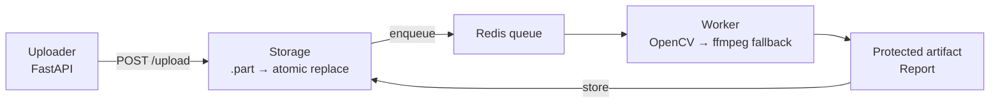

# Adversarial Video Poisoning & Content Protection Pipeline

A production-oriented, local-first reference for ingesting, processing, protecting, and validating video artifacts in a YouTube-style pipeline.

**Defensive research demo.** Not affiliated with YouTube or Google. Model-dependent protection is not guaranteed against scraping, training, or future adaptive defenses.

**What this project is**
- A compact end-to-end stack that accepts uploads, enqueues processing jobs, runs a resilient video worker (OpenCV + ffmpeg), and produces protection & robustness reports.
- Useful for research, demos, CI-based runtime validation, and testing defenses against simple adversarial perturbations.

**Why it stands out**
- **Resilient processing**: primary OpenCV pipeline with layered `ffmpeg` fallbacks for malformed or fragmented MP4s.
- **Atomic storage semantics**: uploads are written to `.part` files, flushed, fsynced, and atomically replaced to avoid races.
- **Infra-ready**: `docker-compose.yml` for local stacks and `k8s/` manifests for cluster deployments (secrets are parameterized).
- **Test-first**: deterministic sample video generator and integration/concurrency tests to reproduce behaviors reliably.

**Key artifacts**
- Protection worker: [workers/video_worker.py](workers/video_worker.py)
- Atomic uploader: [api/utils/storage.py](api/utils/storage.py)
- Sample generator: [tools/generate_sample_video.py](tools/generate_sample_video.py)
- Integration test example: [tests/integration_test.py](tests/integration_test.py)
- Compose orchestration: [docker-compose.yml](docker-compose.yml)
- Kubernetes notes: [k8s/README.md](k8s/README.md)

**Architecture (high level)**



Quick demo flow: upload → queued → processed → `uploads/protected-<job_id>.mp4` + report JSON.

## Quickstart (local)

Prerequisites: `Docker`, `docker-compose`, and Python 3.11.

1) Build and start the local stack (recommended):

```bash
cd "adversarial-video-protection"
docker-compose build
docker-compose up -d
```

2) Create a deterministic sample video (host):

```bash
python tools/generate_sample_video.py
```

3) Run the integration example (uploads + polls until finished):

```bash
python tests/integration_test.py
```

4) Inspect artifacts in the `uploads/` folder (look for `protected-<job_id>.mp4`) and the produced report metadata.

## Developer workflow

- Run API locally:

```bash
uvicorn api.main:app --reload --host 0.0.0.0 --port 8000
```

- Run a single worker locally (connects to the same Redis instance):

```bash
python workers/video_worker.py
```

- Run tests:

```bash
pytest -q
```

## Docker & Kubernetes

- Worker image: see `docker/Dockerfile.worker` (starts `workers/video_worker.py`).
- Compose file: [docker-compose.yml](docker-compose.yml) spins API, Redis, and worker images for local dev.
- Kubernetes: see `k8s/` for manifests and [k8s/README.md](k8s/README.md) for deployment notes.

## Security & sanity checks

- Do NOT commit secrets or large media. Use `.env` for local secrets (see `.env.example`).
- If secrets were committed historically, purge history with `git filter-repo` or `bfg` before publishing.

## Contributing

- Small PRs welcome. Use the included `CONTRIBUTING.md` and PR template.
- For feature work, open an issue describing the goal and the validation plan.

## License

- MIT — see `LICENSE`.

---
