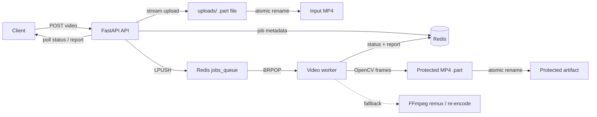

# Adversarial Video Protection Pipeline

> A local-first, asynchronous video-processing platform for defensive research, media robustness experiments, and production-style pipeline demos.

**Defensive research demo.** This project is not affiliated with YouTube or Google. Model-dependent protection is experimental and is not a guarantee against scraping, training, or future adaptive defenses.

## Why this project?

Video protection is more than a frame transformation. A useful system must also handle large uploads, asynchronous work, unreliable media containers, concurrent jobs, reproducible tests, and observable results.

This repository demonstrates that surrounding engineering system:

- FastAPI ingestion API with asynchronous job submission
- Redis-backed queue and job-status store
- OpenCV frame pipeline with FFmpeg remux and re-encode fallbacks
- Atomic upload and output-file semantics to prevent partial-file races
- Docker Compose stack for local development
- CPU and GPU-oriented worker images
- Kubernetes deployment examples
- Integration, latency, and concurrent-load test scripts

## Architecture



### End-to-end flow

1. A client uploads a video to `POST /api/v1/protection/jobs`.
2. The API streams the upload to `uploads/<job>.part`.
3. The file is flushed, `fsync`-ed, and atomically renamed into place.
4. Job metadata is stored in Redis and the job is pushed to `jobs_queue`.
5. A worker consumes the job and marks it `PROCESSING`.
6. OpenCV reads and reconstructs the frames. FFmpeg repairs or re-encodes inputs OpenCV cannot open.
7. The worker writes `uploads/protected-<job_id>.mp4.part.mp4`, then atomically publishes the final artifact.
8. Redis receives the final state, output path, frame count, and report metadata.

## Quickstart

### Prerequisites

- Docker Desktop with Compose
- Python 3.11+
- At least one available local port: `8000`, `6379`, and `5432`

### Run the demo

```bash
git clone https://github.com/Sakshi8365/Adversarial-Video-Poisoning-Content-Protection-Pipeline.git
cd Adversarial-Video-Poisoning-Content-Protection-Pipeline
copy .env.example .env
docker compose build
docker compose up -d
python tools/generate_sample_video.py
python tests/integration_test.py
```

The integration script uploads `uploads/sample.mp4`, polls until the job finishes, and reports the final state. Successful runs create an artifact similar to:

```text
uploads/protected-<job_id>.mp4
```

Inspect the API manually:

```bash
curl http://localhost:8000/api/v1/health
curl http://localhost:8000/api/v1/protection/jobs/<job_id>/status
curl http://localhost:8000/api/v1/protection/jobs/<job_id>/report
```

## API surface

| Method | Endpoint | Purpose |
| --- | --- | --- |
| `GET` | `/api/v1/health` | Service health check |
| `POST` | `/api/v1/protection/jobs` | Upload a video and enqueue a job |
| `GET` | `/api/v1/protection/jobs/{job_id}` | Retrieve the complete job record |
| `GET` | `/api/v1/protection/jobs/{job_id}/status` | Retrieve the current state |
| `GET` | `/api/v1/protection/jobs/{job_id}/results` | Retrieve output metadata |
| `GET` | `/api/v1/protection/jobs/{job_id}/report` | Retrieve the processing report |

Example upload:

```bash
curl -X POST \
	-F "file=@uploads/sample.mp4;type=video/mp4" \
	"http://localhost:8000/api/v1/protection/jobs?target_model=resnet50"
```

Example response:

```json
{
	"job_id": "a-generated-uuid",
	"status": "queued"
}
```

## Implementation highlights

### Resilient media processing

The worker uses a layered strategy:

```text
OpenCV read/write
		-> FFmpeg stream-copy remux with faststart
		-> FFmpeg H.264/AAC re-encode
		-> FAILED with stored error metadata
```

This handles common MP4 problems such as missing or misplaced `moov` metadata and codec/container combinations that OpenCV cannot decode.

### Atomic storage

Both uploaded and generated files use temporary paths followed by atomic replacement. A worker never sees an upload until it is complete, and clients never see a generated artifact until the worker has finished writing it.

### Asynchronous processing

The API returns `202 Accepted` immediately. Redis decouples request handling from CPU/GPU-intensive video work, allowing API and worker processes to scale independently.

### Reproducible validation

The deterministic sample generator and test scripts make it possible to reproduce pipeline behavior locally and measure it under load.

## Testing and benchmarks

```bash
pytest -q
python tests/integration_test.py
python tests/metrics_run.py
python tests/concurrent_load.py
```

The benchmark scripts record success rate, mean and percentile latency, throughput, concurrent completion behavior, and optional CPU/memory samples under `tests/metrics_output/`.

## Deployment options

| Scenario | Entry point |
| --- | --- |
| Local API, Redis, worker, and PostgreSQL | `docker-compose.yml` |
| Optional GPU worker image | `docker-compose.ml.yml` |
| CPU worker image with FFmpeg | `docker/Dockerfile.worker` |
| CUDA/PyTorch worker image | `docker/Dockerfile.worker.gpu` |
| Kubernetes deployment examples | `k8s/` |

Kubernetes credentials are intentionally parameterized. Use Kubernetes Secrets, Helm values, or a cloud secret manager for real deployments; do not commit plaintext credentials.

## Current scope and roadmap

The current worker performs a no-op frame reconstruction and produces processing metadata. The pipeline is intentionally separated from the model-specific algorithm so protection methods can be added without redesigning ingestion, queueing, storage, or reporting.

Planned production improvements:

- Add model registry and model-versioned protection transforms
- Add robustness evaluation against resizing, compression, cropping, and frame sampling
- Move media artifacts from local disk to object storage
- Add Redis Streams or another acknowledged queue with retries and a dead-letter queue
- Add authentication, authorization, upload limits, rate limiting, and signed artifact URLs
- Export structured logs, queue-depth metrics, and distributed traces
- Replace Kubernetes placeholder values with managed secret references

## Security and responsible use

- Do not commit `.env` files, credentials, tokens, or large media files.
- Treat uploaded videos as untrusted input and add file-size, codec, duration, and resource limits before production use.
- Model-dependent protection should be evaluated empirically and should never be presented as a universal guarantee.
- See `.env.example`, `CONTRIBUTING.md`, and the pull-request template for repository conventions.

## Project guide

- [Worker implementation](workers/video_worker.py)
- [FastAPI routes](api/routes/protection.py)
- [Atomic storage helper](api/utils/storage.py)
- [Redis queue implementation](cache/redis_queue.py)
- [Sample video generator](tools/generate_sample_video.py)
- [Integration test](tests/integration_test.py)
- [Kubernetes notes](k8s/README.md)

## Contributing

Small, focused pull requests are welcome. Please include reproducible steps, tests for behavioral changes, and documentation updates where appropriate. See [CONTRIBUTING.md](CONTRIBUTING.md).
